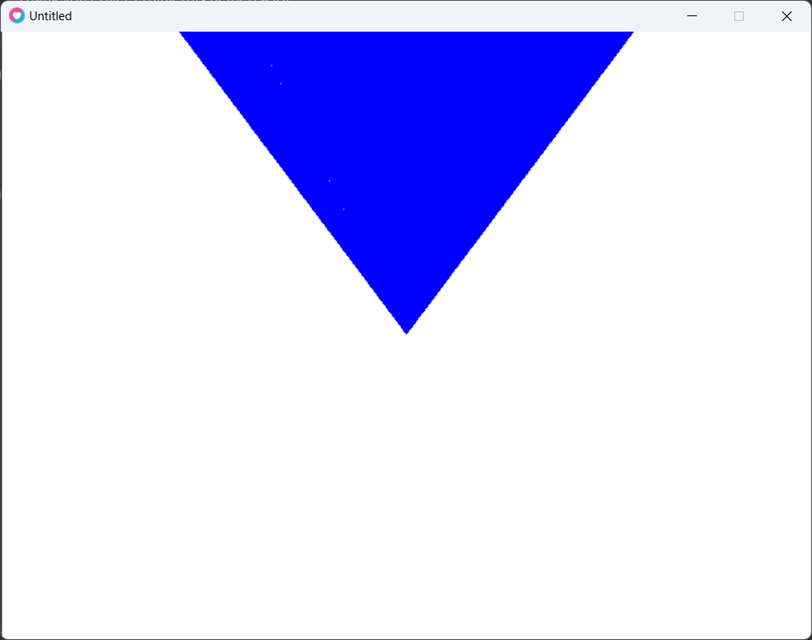

# implicit-RT-triangle
 triangle  


```lua
local dream = require("3DreamEngine")

dream:init()
local vec3 = dream.vec3

function dump(t)
    for k, v in ipairs(t) do print(v[1] .. ',' .. v[2] .. ',' .. v[3] .. ',' .. v[4] .. ',' .. v[5] .. ',' .. v[6]) end
end
function dot(u, v)
    return u[1] * v[1] + u[2] * v[2] + u[3] * v[3]
end

function norm(a)

    return a / math.sqrt(a[1] * a[1] + a[2] * a[2] + a[3] * a[3])
end

function sub(u, v)
    vec.x = u[1] - v[1]
    vec.y = u[2] - v[2]
    vec.z = u[3] - v[3]
    return vec

end

local point = {}
point.x = 0
point.y = 0
point.z = 0

local vec = {}
vec.x = 0
vec.y = 0
vec.z = 0

center = vec3(0, 0, -1)

local vp_height = 2.0
local vp_width = (16.0 / 9.0) * vp_height
local focal_length = 1.0

local h = vec3(vp_width, 0, 0)
local v = vec3(0, vp_height, 0)

ray = {}
-- ray.origin = vec3(0,0,0)
ray.origin = vec3(-2, -2, 0)

local lower_left_corner = ray.origin - h / 2 - v / 2 - vec3(0, 0, focal_length)

print(lower_left_corner)

function hit_sphere(center, r, ray)
    oc = ray.origin - center

    a = dot(ray.dir, ray.dir)

    b = 2.0 * dot(oc, ray.dir)

    c = dot(oc, oc) - r * r
    delta = b * b - 4 * a * c
    return delta > 0
end

function hit_triangle(ray)
    local originX = ray.origin[1]
    local originY = ray.origin[2]
    local dirX = ray.dir[1]
    local dirY = ray.dir[2]
    local t0 = (1.0 - originY - originX) / (dirX + dirY)
    local t1 = -(1.0 - originY + originX) / (dirX - dirY)

    t0 = math.clamp(0.0, t0, 1.0)
    t1 = math.clamp(0.0, t1, 1.0)

    if 1.0 - (originY + t0 * dirY) <= 0 and t0 > 0 then

        return true

    elseif 1.0 - (originY + t1 * dirY) <= 0 and t1 > 0 then

        return true

    end

    return false
end

function ray_color_triangle(ray)
    if hit_triangle(ray) then
        return vec3(0, 1, 0)
    end
    return vec3(1, 1, 1)
end

function ray_color(ray)
    if hit_sphere(center, 0.5, ray) then
        return vec3(0, 0, 1)
    end
    return vec3(1, 1, 1)
end

function loadQuad()
 
end

function loadTriangle(w, height)
    local screen_width, screen_height = love.graphics.getDimensions()

    -- how many stars we want local max_stars =
    triPoints = {} -- table which will hold our stars

    local x = w
    local y = height

    for x = 1, w do
        for y = 1, height do

            local r = math.abs(x / w - 1)
            local g = math.abs(y / height - 1)
            ray.dir =
            norm(
            lower_left_corner + r * h + g * v - ray.origin)
            -- print(ray.dir)

            color = ray_color_triangle(ray)

            table.insert(triPoints, {x, y, color[1], color[2], color[3], 1})

        end

    end

end
local screen_width, screen_height = love.graphics.getDimensions()

function loadSphere()

    -- how many stars we want local max_stars =
    spherePoints = {} -- table which will hold our stars

    local x = 200
    local y = 200

    for x = 1, screen_width do
        for y = 1, screen_height do

            local r = math.abs(x / screen_width - 1)
            local g = math.abs(y / screen_height - 1)
            ray.dir =
            norm(
            lower_left_corner + r * h + g * v - ray.origin)
            -- print(ray.dir)

            color = ray_color(ray)

            table.insert(spherePoints, {x, y, color[1], color[2], color[3], 1})

        end

    end

end

function love.load()
    -- loadSphere()
    loadTriangle(screen_width, screen_height)

end

function love.draw()
    -- love.graphics.points(spherePoints)

    love.graphics.points(triPoints)
end
```
